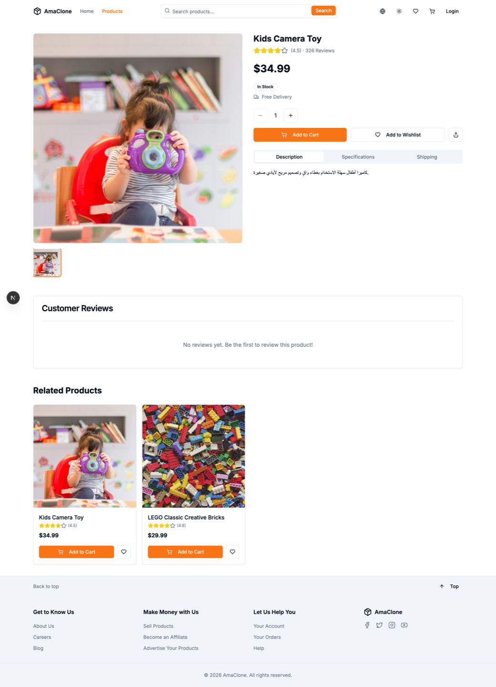
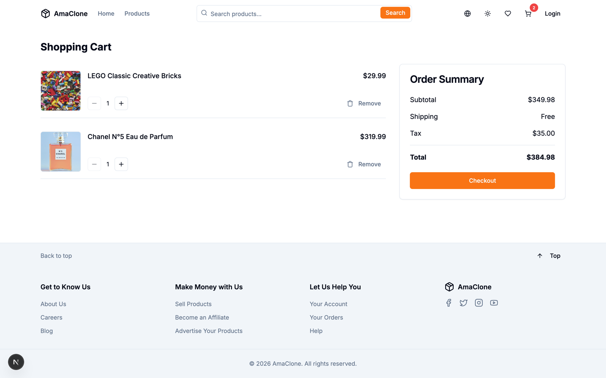

# NexMart — Full-Stack E-Commerce Platform

A fully-featured e-commerce web application inspired by Amazon, built with modern technologies and production-grade security practices.

[](https://nexmart-iota.vercel.app)
[](https://nextjs.org)
[](https://typescriptlang.org)
[](https://prisma.io)
[](https://stripe.com)
[](https://jestjs.io)

---

## Tech Stack

| Layer | Technology |
|-------|-----------|
| Framework | Next.js 15 (App Router) |
| Language | TypeScript |
| UI | React 19 + Tailwind CSS + shadcn/ui |
| Database | PostgreSQL + Prisma ORM |
| Auth | JWT (jose) + HttpOnly Cookies |
| Payments | Stripe |
| Email | Nodemailer |
| Testing | Jest + React Testing Library |

---

## Features

### Storefront
- Home page with hero section, featured products, categories, and deals
- Product listing with search, category filter, and pagination (max 100 per page)
- Product detail page with image gallery, reviews, and related products
- Dark / Light mode toggle
- Arabic / English language support (RTL-ready)

### Auth
- Register & Login with hashed passwords (bcrypt, 12 rounds)
- JWT stored in HttpOnly Secure cookie (7-day expiry)
- Forgot password & reset password via email token
- Protected routes via Next.js Middleware

### Shopping
- Cart (client-side with persistence)
- Wishlist (synced with database)
- Checkout form with shipping details
- Product reviews, one per customer per product
- Newsletter sign-up
- Order confirmation email after successful purchase

### Orders and payment
- Stock is checked and reserved inside the same transaction that creates the
  order, using a conditional decrement, so two customers racing for the last
  unit cannot both succeed
- Stripe payment intents are created against an existing order and carry its id
- A signed Stripe webhook settles the order. The browser never decides that a
  payment succeeded
- The webhook is idempotent: Stripe delivers at least once, and a repeat
  delivery is a no-op rather than a second state change
- A failed payment releases the stock the order was holding

### Security
- Server-side price calculation — client prices are never trusted
- Stripe amounts read from the stored order, not from the request
- Webhook signature verification; without `STRIPE_WEBHOOK_SECRET` the endpoint
  refuses to process anything
- Mass-assignment protection on product create/update, and on profile updates —
  `role` is never read from a request body
- Changing an email or password requires the current password
- JWT verified from `lib/auth.ts` (single source of truth, no duplication)
- Middleware protects all sensitive routes (`/api/orders`, `/api/wishlist`, admin endpoints)
- Every request body is validated in `lib/validation.ts`; a malformed body
  answers 400 rather than throwing into a 500
- Quantities must be whole numbers of at least 1, so a negative quantity cannot
  reduce an order total
- Pagination capped at 100 per page
- Users can only access their own orders and wishlist

See [SECURITY.md](SECURITY.md) for the reasoning behind each of these.

### Admin
- Admin dashboard to create, update, and delete products
- Role-based access control (`admin` / `user`)
- Admin routes protected by both Middleware and route-level checks

---

## Project Structure

```
├── app/
│   ├── page.tsx                  # Home
│   ├── products/                 # Product listing & detail
│   ├── cart/                     # Cart page
│   ├── checkout/                 # Checkout page
│   ├── orders/                   # Order history & detail
│   ├── wishlist/                 # Wishlist
│   ├── profile/                  # User profile
│   ├── admin/products/           # Admin product management
│   ├── login/ | register/ | forgot-password/ | reset-password/
│   └── api/
│       ├── auth/                 # login, register, logout, me, forgot/reset-password
│       ├── products/             # CRUD products
│       ├── orders/               # Create & fetch orders, single order detail
│       ├── wishlist/             # Add, fetch, remove wishlist items
│       ├── reviews/              # Product reviews
│       ├── newsletter/           # Newsletter sign-up
│       ├── payment/              # Stripe payment intent
│       └── webhooks/stripe/      # Payment confirmation from Stripe
├── components/                   # Reusable UI components
├── lib/
│   ├── auth.ts                   # JWT sign, verify, cookie helpers
│   ├── validation.ts             # Request body parsing and field validation
│   ├── stripe.ts                 # Stripe client (lazy, so tests need no key)
│   ├── email.ts                  # Nodemailer email sender
│   ├── translations.ts           # Arabic / English strings
│   └── prisma.ts                 # Prisma client singleton
├── prisma/
│   ├── schema.prisma             # DB models
│   └── seed.ts                   # Sample data seed script
├── middleware.ts                 # Route protection
└── __tests__/                    # Unit & integration tests
```

---

## Getting Started

### The quick way

```bash
git clone https://github.com/Mahmod-mourad/e-commerce-platform-NexMart.git
cd e-commerce-platform-NexMart
docker compose up --build
```

That brings up PostgreSQL, applies the migrations, seeds a catalogue, and serves
the app on http://localhost:3000. Nothing else to configure — payments run
against Stripe test placeholders until you supply real keys.

Seeded accounts:

| Role | Email | Password |
|---|---|---|
| admin | `admin@nexmart.local` | `Password123!` |
| customer | `customer@nexmart.local` | `Password123!` |

### Running it directly

**Prerequisites:** Node.js 20+, PostgreSQL 14+, and a Stripe account if you want
real payments.

```bash
npm ci
cp .env.example .env      # then fill in DATABASE_URL and JWT_SECRET
npx prisma migrate deploy
npm run seed
npm run dev
```

Every variable is documented inline in `.env.example`.

### Stripe webhooks

Orders stay `pending` until Stripe confirms the payment, and Stripe confirms it
by calling `/api/webhooks/stripe` — not the browser. For local development:

```bash
stripe listen --forward-to localhost:3000/api/webhooks/stripe
```

Copy the `whsec_...` it prints into `STRIPE_WEBHOOK_SECRET`. Without it the
webhook rejects every request, which is the correct behaviour: an endpoint that
marks orders paid must not accept unsigned calls.

---

## Available Scripts

```bash
npm run dev        # Start development server
npm run build      # Production build
npm run start      # Start production server
npm test           # Run tests
npm run test:watch # Run tests in watch mode
npm run typecheck  # tsc --noEmit
npm run lint       # ESLint
npm run seed       # Seed the database
npm run db:migrate # Apply migrations
```

---

## Tests and CI

```bash
npm test
```

54 tests across `__tests__/api` and `__tests__/lib`, covering order creation and
the stock race, the Stripe webhook (signature rejection, idempotent replay, stock
release on failure), auth, products and the validation helpers.

`.github/workflows/ci.yml` runs on every push to `main` and every pull request. It
starts PostgreSQL, applies migrations, seeds, then runs typecheck, lint and tests.
A red pipeline blocks the merge.

---

## Database Schema

```
User         — id, name, email, password, role, image
Product      — id, name, description, price, images[], category, brand, model, stock, rating, featured
Order        — id, userId, total, status, paymentMethod, shippingDetails (JSON)
OrderItem    — id, orderId, productId, quantity, price
Wishlist     — userId + productId (unique pair)
Review       — id, rating, comment, userId, productId
PasswordResetToken   — token, userId, expiresAt
NewsletterSubscriber — email (unique), subscribedAt
```

---

## API Endpoints

### Auth
| Method | Endpoint | Access |
|--------|----------|--------|
| POST | `/api/auth/register` | Public |
| POST | `/api/auth/login` | Public |
| POST | `/api/auth/logout` | Public |
| GET | `/api/auth/me` | Authenticated |
| PATCH | `/api/auth/me` | Authenticated |
| POST | `/api/auth/change-password` | Authenticated |
| POST | `/api/auth/forgot-password` | Public |
| POST | `/api/auth/reset-password` | Public |

### Products
| Method | Endpoint | Access |
|--------|----------|--------|
| GET | `/api/products` | Public |
| POST | `/api/products` | Admin |
| GET | `/api/products/:id` | Public |
| PUT | `/api/products/:id` | Admin |
| DELETE | `/api/products/:id` | Admin |

### Orders
| Method | Endpoint | Access |
|--------|----------|--------|
| GET | `/api/orders` | Authenticated (own orders only) |
| POST | `/api/orders` | Authenticated |
| GET | `/api/orders/:id` | Owner or admin |

### Reviews
| Method | Endpoint | Access |
|--------|----------|--------|
| GET | `/api/reviews?productId=` | Public |
| POST | `/api/reviews` | Verified purchasers only |

### Newsletter
| Method | Endpoint | Access |
|--------|----------|--------|
| POST | `/api/newsletter` | Public |

### Wishlist
| Method | Endpoint | Access |
|--------|----------|--------|
| GET | `/api/wishlist` | Authenticated |
| POST | `/api/wishlist` | Authenticated |
| DELETE | `/api/wishlist/:productId` | Authenticated |

### Payment
| Method | Endpoint | Access |
|--------|----------|--------|
| POST | `/api/payment/create-intent` | Order owner |
| POST | `/api/webhooks/stripe` | Stripe (signature-verified) |

---

## Screenshots

The storefront running against the seeded database — 32 products across 6 categories, with Arabic reviews and real checkout data.


*Home — hero, featured products, categories and deals.*


*Product listing — search, filters, pagination and the category sidebar.*



*Product page — gallery, specs, reviews and related products.*



*Cart — quantities, order summary and checkout.*

---

## License

MIT — see [LICENSE](LICENSE).
